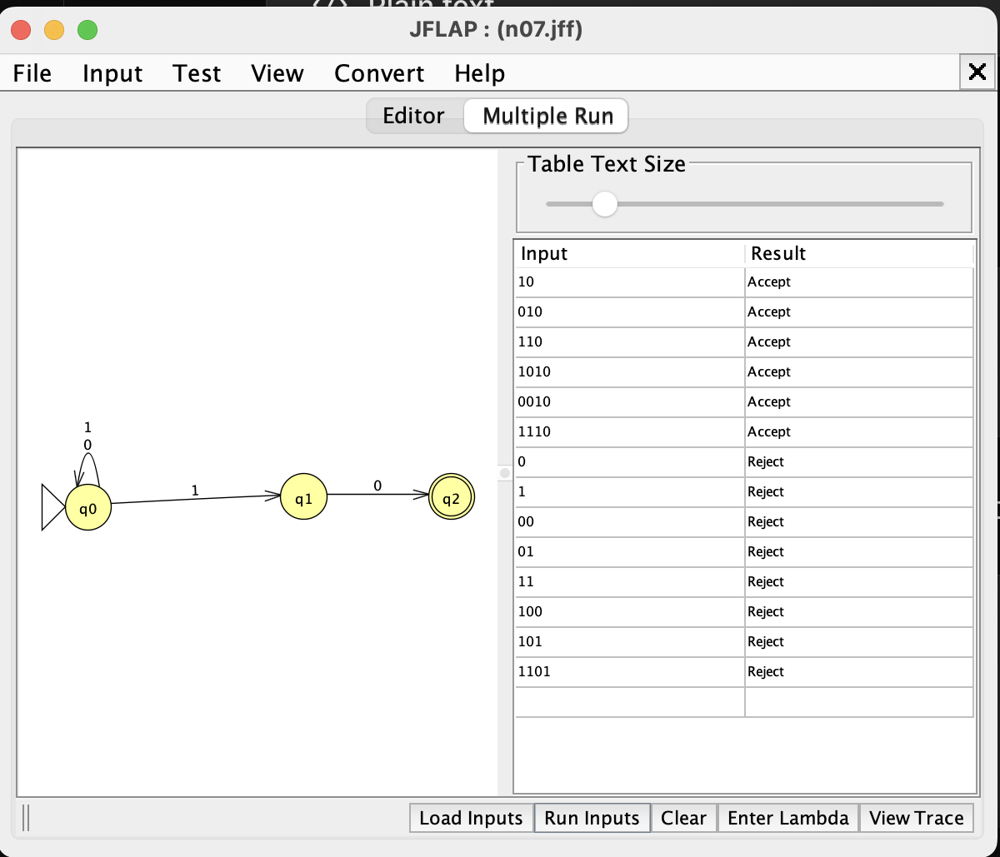
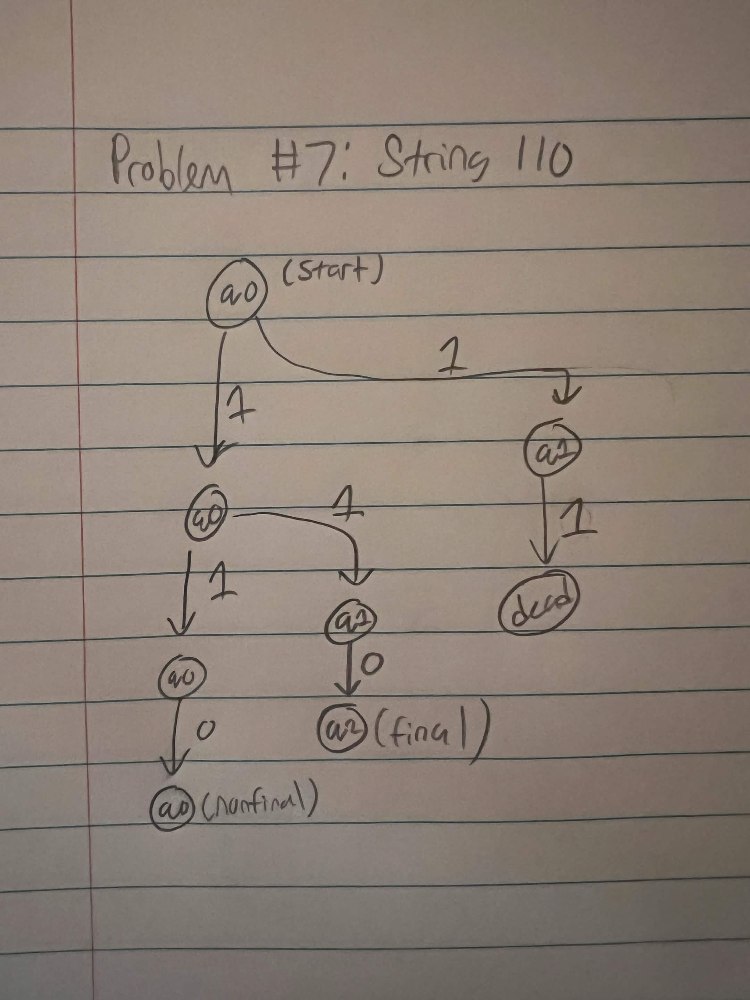
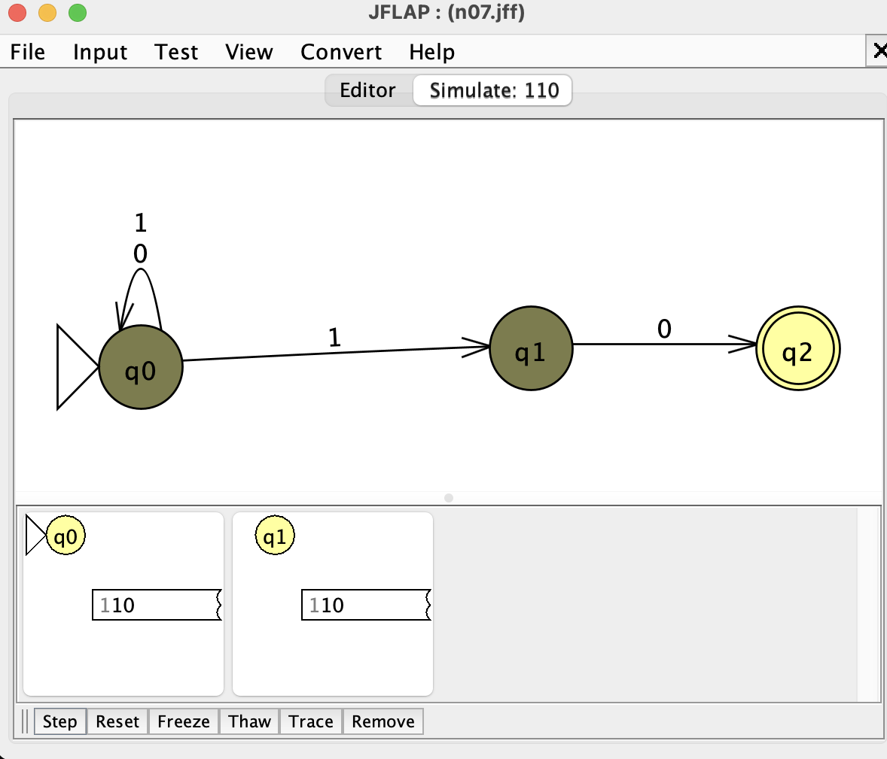
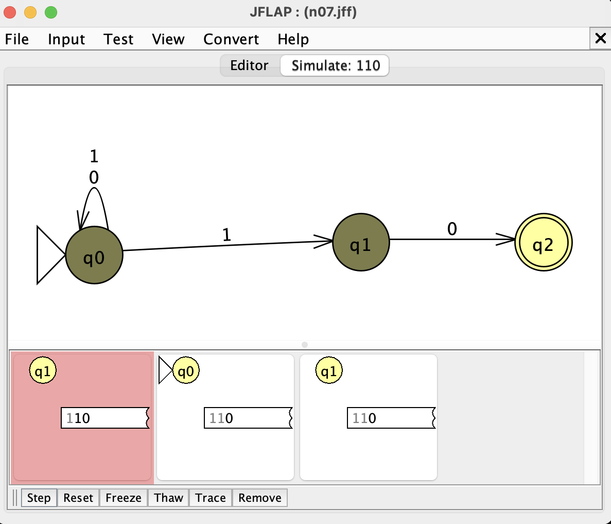
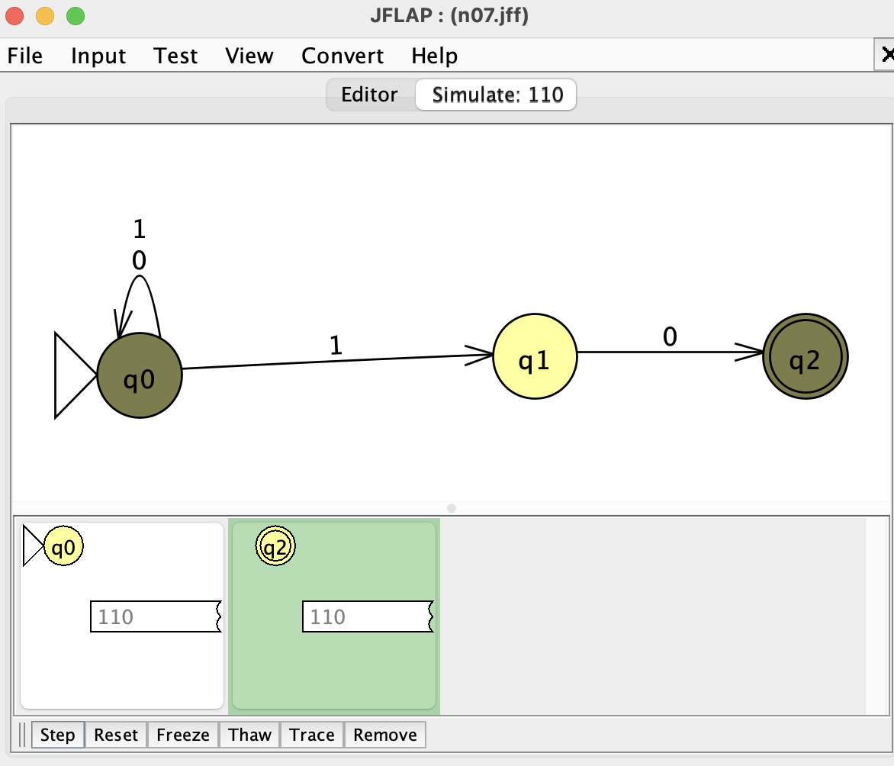

# Problem 7: Strings that end with 10

## NFA and batch-run evidence

## Hand-drawn computation tree

Gold string: `110`

## JFLAP state-transition screenshots

### After reading `1`

### After reading `11`

### After reading `110`

