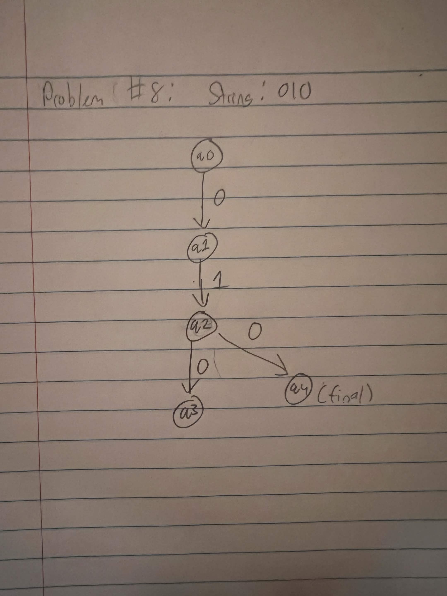

# Problem 8: Strings that start with 01 and end with 10

## NFA and batch-run evidence

## Hand-drawn computation tree

Gold string: `010`

## JFLAP state-transition evidence

### After reading `0`

### After reading `01`

### After reading `010`

