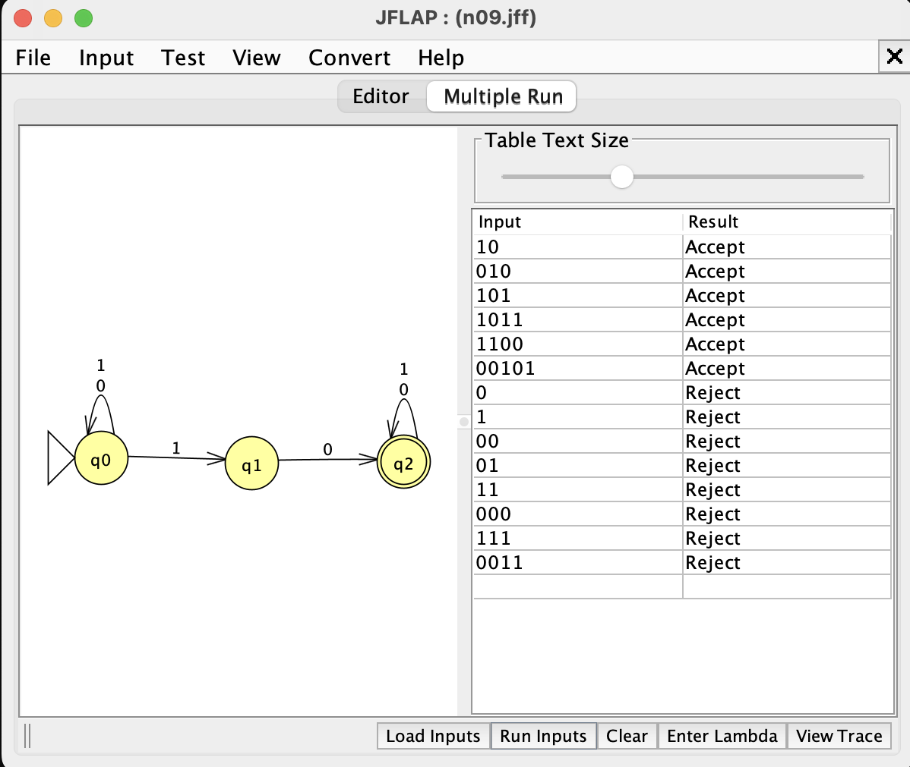
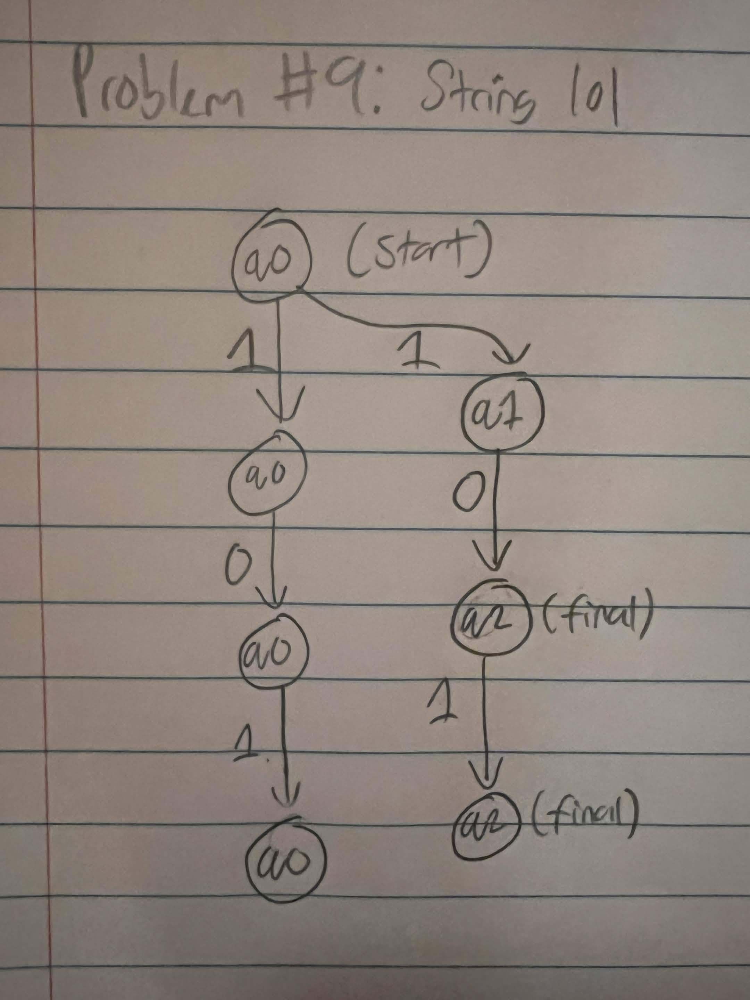
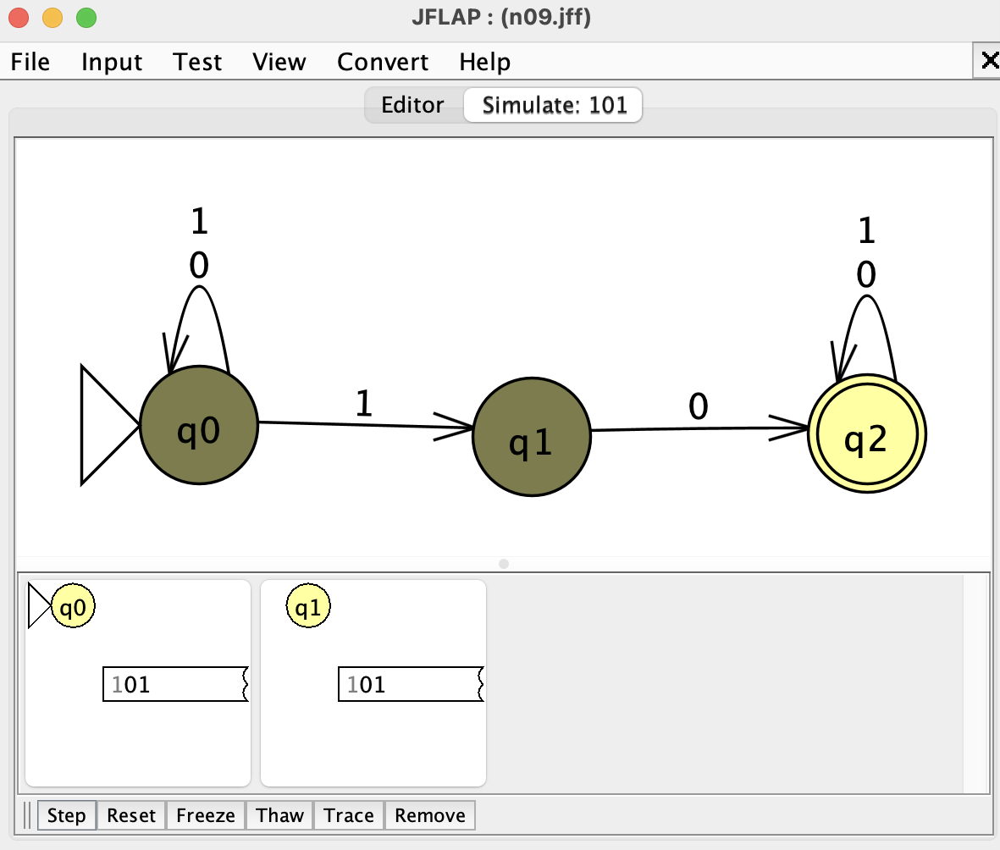
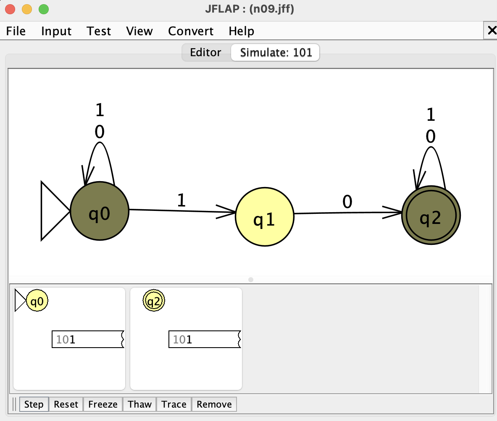
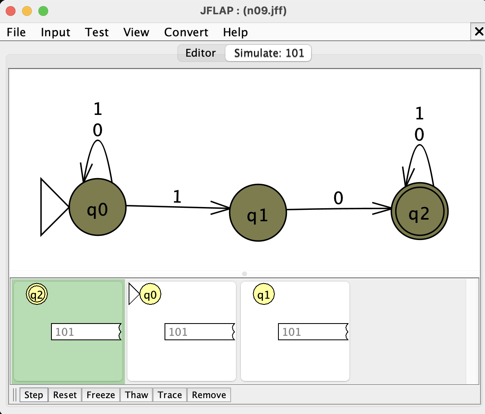

# Problem 9: Strings that contain the substring 10

## NFA and batch-run evidence

## Hand-drawn computation tree

Gold string: `101`

## JFLAP state-transition screenshots

### After reading `1`

### After reading `10`

### After reading `101`

